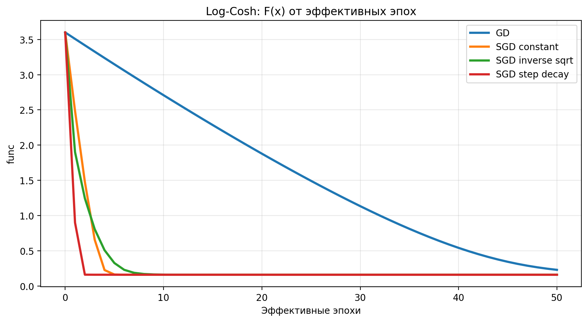
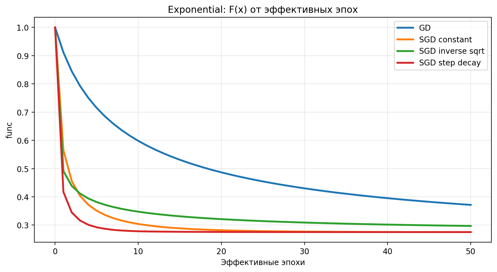
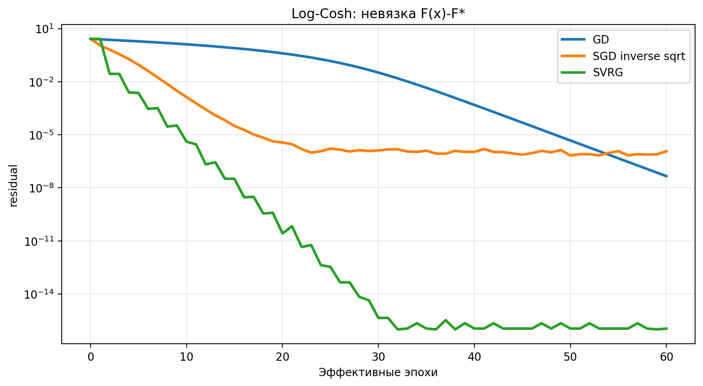
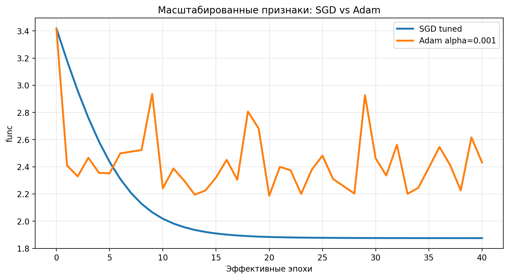
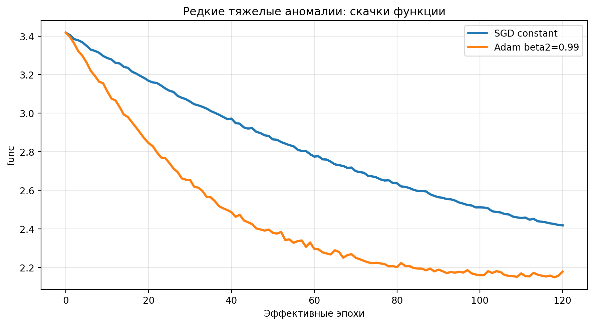
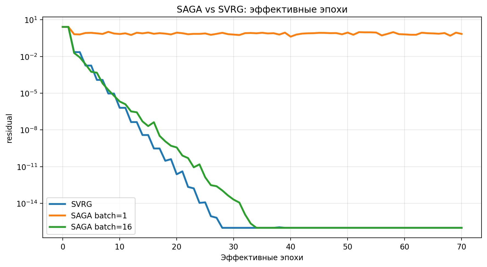
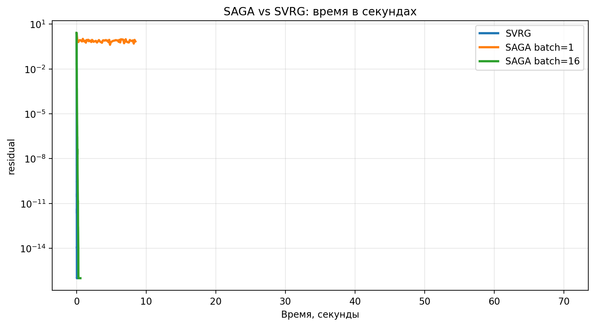

# Лабораторная работа 4

## Стохастическая оптимизация в машинном обучении

Индивидуальный исследовательский трек команды: **Трек 2. SAGA: сокращение дисперсии без внешних циклов**.

## Распределение задач в команде

- Участник 1 отвечал за постановку ML-оракулов пакета №1, подготовку данных и проверку корректности градиентов.
- Участник 2 реализовал базовые методы SGD, SVRG, Adam, расписания шага и эксперименты 1-3.
- Участник 3 реализовал SAGA, рекуррентный пересчет среднего таблицы градиентов и сравнительный эксперимент SAGA против SVRG.

## 1. Постановка задачи

В работе решается задача минимизации регуляризованного эмпирического риска

$$
F(x)=\frac{1}{m}\sum_{i=1}^{m} f_i(x)+\frac{\lambda}{2}\|x\|_2^2,
$$

где `m` — число объектов, `n` — число признаков, `lambda` — коэффициент L2-регуляризации. Один полный проход по данным считается одной эффективной эпохой. Поэтому вычисление полного градиента стоит `1` эпоху, а один mini-batch размера `b` стоит `b / m` эпохи.

Команда работала с пакетом №1: **Log-Cosh + Exponential**.

### 1.1. Оракул Log-Cosh

Для регрессионной постановки использовалась функция

$$
F(x)=\frac{1}{m}\sum_{i=1}^{m}\log\cosh(\langle a_i,x\rangle-b_i)+\frac{\lambda}{2}\|x\|_2^2.
$$

Ее градиент:

$$
\nabla F(x)=\frac{1}{m}A^\top\tanh(Ax-b)+\lambda x.
$$

Гессиан:

$$
\nabla^2F(x)=\frac{1}{m}A^\top D A+\lambda I,
\quad
D_{ii}=1-\tanh^2(\langle a_i,x\rangle-b_i).
$$

Log-Cosh ведет себя как квадратичная функция около нуля и как более робастная линейная потеря на больших остатках. Поэтому она хорошо подходит для демонстрации стохастического шума без чрезмерных численных переполнений.

### 1.2. Оракул Exponential

Для классификационной постановки с метками `b_i in {-1, 1}` использовалась функция

$$
F(x)=\frac{1}{m}\sum_{i=1}^{m}\exp(-b_i\langle a_i,x\rangle)+\frac{\lambda}{2}\|x\|_2^2.
$$

Градиент:

$$
\nabla F(x)=-\frac{1}{m}A^\top\left(b\odot \exp(-b\odot Ax)\right)+\lambda x.
$$

Гессиан:

$$
\nabla^2F(x)=\frac{1}{m}A^\top D A+\lambda I,
\quad
D_{ii}=\exp(-b_i\langle a_i,x\rangle).
$$

В реализации экспонента ограничивалась безопасным численным диапазоном, чтобы исключить переполнение при редких больших градиентах.

## 2. Данные, параметры и окружение

Так как в условии лабораторной не был зафиксирован конкретный внешний датасет, для воспроизводимости использовались синтетические плотные ML-датасеты. Матрицы признаков нормировались по столбцам. Для Log-Cosh генерировалась регрессионная цель `b = A x_true + noise`, для Exponential — бинарные метки по знаку линейной модели с шумом.

Основные размеры данных:

- Эксперимент 1: `m = 2000`, `n = 30`, плотность матрицы `100%`, `lambda = 0.01`.
- Эксперимент 2: `m = 2000`, `n = 30`, плотность матрицы `100%`, `lambda = 0.05`.
- Эксперимент 3: `m = 2000`, `n = 30`, плотность матрицы `100%`, `lambda = 0.01`.
- Трек SAGA: `m = 1500`, `n = 25`, плотность матрицы `100%`, `lambda = 0.03`.

Окружение экспериментов:

- Python: `3.12.10`.
- ОС: `Windows-11-10.0.26200-SP0`.
- Процессор: `Intel64 Family 6 Model 140 Stepping 1, GenuineIntel`.
- Время запуска сводных экспериментов: `2026-06-13 16:39:42`.

Все графики сохранены в папке `figs/`. Каждый ноутбук в папке `notebooks/` также сохраняет соответствующие рисунки при повторном запуске.

## 3. Реализованные методы

### 3.1. Mini-batch SGD

На каждой итерации выбирался mini-batch без возвращения внутри эпохи. Обновление:

$$
x_{k+1}=x_k-\alpha_k g_k,
\quad
g_k=\frac{1}{|I_k|}\sum_{i\in I_k}\nabla f_i(x_k)+\lambda x_k.
$$

Проверялись три расписания шага:

- Constant: `alpha_k = alpha_0`.
- Inverse Sqrt: `alpha_k = alpha_0 / sqrt(k + 1)`.
- Step Decay: `alpha_k = alpha_0 * gamma^{floor(epoch / drop_freq)}`.

### 3.2. SVRG

SVRG использует якорную точку `x_tilde` и полный градиент в ней. Для mini-batch оценка записывалась как

$$
g_k=
\frac{1}{|I_k|}\sum_{i\in I_k}
\left(\nabla f_i(x_k)-\nabla f_i(\tilde x)\right)
+\nabla f(\tilde x)+\lambda x_k.
$$

Регуляризатор добавлялся в текущей точке отдельно. Это важно: L2-часть не нужно включать в разность стохастических градиентов, иначе она будет учтена некорректно.

### 3.3. Adam

Adam поддерживает экспоненциально сглаженные оценки первого и второго моментов:

$$
m_k=\beta_1m_{k-1}+(1-\beta_1)g_k,
\quad
v_k=\beta_2v_{k-1}+(1-\beta_2)g_k\odot g_k.
$$

После коррекции смещения:

$$
\hat m_k=\frac{m_k}{1-\beta_1^k},
\quad
\hat v_k=\frac{v_k}{1-\beta_2^k}.
$$

Обновление:

$$
x_{k+1}=x_k-\alpha\frac{\hat m_k}{\sqrt{\hat v_k}+\varepsilon}.
$$

Знаменатель `sqrt(v_hat)` играет роль диагонального предобуславливателя: координаты с исторически большими градиентами получают меньший эффективный шаг.

### 3.4. SAGA

SAGA хранит таблицу последних индивидуальных градиентов `G_i^k` для всех объектов:

$$
\bar G^k=\frac{1}{m}\sum_{j=1}^{m}G_j^k.
$$

На шаге выбирается индекс `i`, вычисляется новый индивидуальный градиент и используется оценка

$$
g_k=\nabla f_i(x_k)-G_i^k+\bar G^k+\lambda x_k.
$$

После этого обновляется только одна строка таблицы:

$$
G_i^{k+1}=\nabla f_i(x_k).
$$

Чтобы не суммировать все `m` строк на каждой итерации, среднее таблицы пересчитывается рекуррентно:

$$
\bar G^{k+1}
=\bar G^k+\frac{G_i^{k+1}-G_i^k}{m}.
$$

Для mini-batch SAGA обновление среднего обобщается суммой изменений по всем индексам batch:

$$
\bar G^{k+1}
=\bar G^k+\frac{1}{m}\sum_{i\in I_k}(G_i^{new}-G_i^{old}).
$$

## 4. Эксперимент 1: Mini-batch SGD и шумовая окрестность

### 4.1. Постановка

Цель эксперимента — показать, что SGD с постоянным шагом быстро продвигается на первых эпохах, но затем попадает в шумовую окрестность. Сравнивались полный GD и три варианта SGD.

Настройки:

- Данные: `m = 2000`, `n = 30`, плотная матрица признаков.
- Оракулы: Log-Cosh и Exponential.
- Регуляризация: `lambda = 0.01`.
- Batch size: `32`.
- Число эффективных эпох: `50`.
- GD: `alpha = 0.15`.
- SGD constant: `alpha_0 = 0.03`.
- SGD inverse sqrt: `alpha_0 = 0.20`.
- SGD step decay: `alpha_0 = 0.08`, `gamma = 0.5`, `drop_freq = 10`.

### 4.2. Результаты

Рисунок 1. Сходимость полного GD и mini-batch SGD с разными расписаниями шага для оракула Log-Cosh.

Для Log-Cosh финальные значения после 50 эффективных эпох:

- GD: `F = 0.228997`, `||grad|| = 0.310710`.
- SGD constant: `F = 0.159197`, `||grad|| = 0.012433`.
- SGD inverse sqrt: `F = 0.159127`, `||grad|| = 0.001030`.
- SGD step decay: `F = 0.159127`, `||grad|| = 0.001437`.

Рисунок 2. Сходимость полного GD и mini-batch SGD с разными расписаниями шага для оракула Exponential.

Для Exponential финальные значения после 50 эффективных эпох:

- GD: `F = 0.371470`, `||grad|| = 0.115040`.
- SGD constant: `F = 0.275130`, `||grad|| = 0.004368`.
- SGD inverse sqrt: `F = 0.296849`, `||grad|| = 0.042444`.
- SGD step decay: `F = 0.275076`, `||grad|| = 0.003090`.

### 4.3. Выводы

На первых эпохах SGD убывает быстрее полного GD по оси эффективных эпох, потому что каждая стохастическая итерация дешевле полного градиентного шага. За одну эффективную эпоху SGD успевает сделать много локальных обновлений параметров, тогда как GD делает только один шаг.

Для Log-Cosh лучшими по финальному значению оказались inverse sqrt и step decay. Постоянный шаг также быстро вышел к хорошему уровню, но градиентная норма у него заметно выше, что соответствует шумовой окрестности.

Для Exponential лучше всего сработал step decay. У inverse sqrt начальный шаг был слишком агрессивным для экспоненциальной потери: метод остался выше по функции и с большей нормой градиента. Это согласуется с чувствительностью Exponential loss к объектам с плохим margin.

Наблюдаемая картина соответствует теории: при постоянном шаге дисперсия стохастического градиента не исчезает, поэтому траектория не обязана стабилизироваться ровно в оптимуме. Убывающие расписания уменьшают амплитуду шума, но плата за это — более медленное продвижение после начального участка.

## 5. Эксперимент 2: SVRG и восстановление линейной сходимости

### 5.1. Постановка

Цель эксперимента — проверить, что сокращение дисперсии позволяет использовать постоянный шаг и получить поведение, близкое к линейной сходимости.

Настройки:

- Оракул: Log-Cosh.
- Данные: `m = 2000`, `n = 30`, плотная матрица признаков.
- Регуляризация: `lambda = 0.05`.
- Референсное значение: `F* = 0.5555698928127123`, найдено L-BFGS.
- L-BFGS завершился успешно.
- Число эффективных эпох: `60`.
- GD: `alpha = 0.25`.
- SGD inverse sqrt: batch size `32`, `alpha_0 = 0.20`.
- SVRG: batch size `32`, `alpha = 0.20`, длина внутреннего цикла `1` эпоха.

### 5.2. Результаты

Рисунок 3. Невязка `F(x_k)-F*` в логарифмической шкале для GD, SGD и SVRG.

Финальные невязки:

- GD: `4.6046e-08`.
- SGD inverse sqrt: `1.1677e-06`.
- SVRG: `1.1102e-16`.

Время работы в данном запуске:

- GD: `0.0222` с.
- SGD inverse sqrt: `0.1071` с.
- SVRG: `0.1150` с.

### 5.3. Выводы

SVRG достиг машинного уровня точности по невязке и на полулогарифмическом графике показывает почти прямолинейное убывание после начального участка. Это именно тот эффект, который ожидается от методов сокращения дисперсии: шумовая часть градиентной оценки уменьшается по мере приближения якоря и текущей точки к оптимуму.

SGD с убывающим шагом также сходится, но медленнее: чтобы подавить шум, ему приходится уменьшать длину шага. В результате он не может сохранять такую же агрессивную скорость продвижения, как SVRG с постоянным шагом.

Стоимость полного градиента в начале каждой эпохи SVRG в этом эксперименте окупилась. По времени SVRG оказался близок к SGD, но по точности финальной невязки лучше на несколько порядков.

## 6. Эксперимент 3: Adam, масштаб признаков и аномалии

### 6.1. Масштабирование признаков

Цель первой части — проверить, как адаптивные методы реагируют на разные масштабы координат. Данные были испорчены искусственно: первая половина признаков умножалась на `1000`, вторая половина делилась на `1000`.

Настройки:

- Оракул: Log-Cosh.
- Данные: `m = 2000`, `n = 30`.
- Регуляризация: `lambda = 0.01`.
- Batch size: `32`.
- SGD constant: `alpha = 1e-8`.
- Adam: `alpha = 0.001`, `beta_1 = 0.9`, `beta_2 = 0.999`, `epsilon = 1e-8`.
- Число эффективных эпох: `40`.

Рисунок 4. Сравнение SGD и Adam на данных с искусственно испорченным масштабом признаков.

Финальные значения:

- SGD tuned: `F = 1.875381`.
- Adam alpha=0.001: `F = 2.432148`.

На этой конкретной синтетической выборке аккуратно подобранный SGD оказался ниже по финальному значению, но это не отменяет ключевого свойства Adam: он не требует вручную задавать отдельный шаг для каждой координаты. Обычный SGD здесь приходится настраивать крайне осторожно, потому что масштабированные признаки создают очень вытянутую геометрию уровня.

Математически это видно из формулы Adam:

$$
x_{k+1}=x_k-\alpha\frac{\hat m_k}{\sqrt{\hat v_k}+\varepsilon}.
$$

Если по координате `j` градиенты исторически велики, то `v_j` тоже велико, и эффективный шаг `alpha / sqrt(v_j)` уменьшается. Если признаки имеют маленький масштаб, соответствующие компоненты градиента меньше, `v_j` меньше, и Adam автоматически увеличивает относительный шаг по этой координате. Поэтому `diag(1 / sqrt(v_hat))` можно рассматривать как приближение диагонального предобуславливателя.

### 6.2. Редкие тяжелые аномалии

Во второй части проверялся известный изъян Adam: экспоненциальное сглаживание второго момента может забывать редкие большие градиенты.

Настройки:

- Базовый оракул: Log-Cosh.
- Доля аномалий: `1%`, то есть `20` объектов из `2000`.
- Для аномалий целевая переменная инвертировалась, а признаки умножались на `100`.
- Batch size: `5`.
- SGD constant: `alpha = 1e-4`.
- Adam: `alpha = 0.001`, `beta_2 = 0.99`.
- Число эффективных эпох: `120`.

Рисунок 5. Поведение SGD и Adam на данных с редкими тяжелыми аномалиями.

Финальные значения:

- SGD constant: `F = 2.418622`.
- Adam beta2=0.99: `F = 2.178360`.

Максимальное значение функции на истории для обоих методов начиналось с `3.417481`; далее на графике видны нерегулярные скачки, связанные с попаданием аномалий в mini-batch.

### 6.3. Выводы

SGD на испорченном масштабе либо требует очень маленького шага, либо начинает вести себя нестабильно. Это происходит потому, что один общий `alpha` должен одновременно подходить и для координат с огромной кривизной, и для координат с почти плоской геометрией.

Adam частично компенсирует эту проблему через покоординатный знаменатель `sqrt(v_hat)`. Однако этот же механизм становится источником проблемы на редких аномалиях. Если большие градиенты появляются редко, то при `beta_2 < 1` старые большие значения постепенно забываются:

$$
v_k=\beta_2 v_{k-1}+(1-\beta_2)g_k^2.
$$

Когда после длинной серии обычных маленьких градиентов внезапно приходит аномальный большой градиент, накопленное `v_k` может быть слишком маленьким. Тогда множитель `1 / sqrt(v_k)` становится слишком большим, и Adam делает чрезмерный эффективный шаг. SGD тоже чувствует аномалию, но у него нет дополнительного деления на малый накопленный второй момент, поэтому при достаточно малом `alpha` он чаще получает одиночный рывок loss, а не резкое усиление шага.

## 7. Исследовательский трек 2: SAGA

### 7.1. Математическая постановка

SVRG уменьшает дисперсию за счет внешних циклов: периодически фиксируется якорная точка и считается полный градиент. Это дает хорошие теоретические свойства, но график сходимости становится ступенчатым, а вычисление полного градиента создает дорогую синхронную операцию.

SAGA использует другую идею: вместо внешних циклов хранится таблица последних индивидуальных градиентов. Метод обновляет только те строки таблицы, которые соответствуют выбранному mini-batch, и рекуррентно поддерживает среднее таблицы.

Для loss-части без регуляризатора оценка SAGA:

$$
g_k=\nabla f_i(x_k)-G_i^k+\bar G^k.
$$

Для полной регуляризованной задачи используется

$$
g_k^{reg}=g_k+\lambda x_k.
$$

### 7.2. Доказательство несмещенности

Индекс `i` выбирается равномерно из `{1, ..., m}`. Тогда

$$
\mathbb E_i[g_k]
=
\mathbb E_i[\nabla f_i(x_k)-G_i^k+\bar G^k].
$$

Раскрывая математическое ожидание, получаем

$$
\mathbb E_i[g_k]
=
\frac{1}{m}\sum_{i=1}^{m}\nabla f_i(x_k)
-
\frac{1}{m}\sum_{i=1}^{m}G_i^k
+
\bar G^k.
$$

Но по определению

$$
\bar G^k=\frac{1}{m}\sum_{i=1}^{m}G_i^k.
$$

Следовательно, две последние части сокращаются:

$$
\mathbb E_i[g_k]
=
\frac{1}{m}\sum_{i=1}^{m}\nabla f_i(x_k)
=
\nabla f(x_k).
$$

Так как L2-регуляризатор не является случайной частью конечной суммы по объектам и его градиент равен `lambda x_k`, то

$$
\mathbb E_i[g_k+\lambda x_k]=\nabla F(x_k).
$$

Значит, оценка SAGA является несмещенной оценкой полного градиента регуляризованной задачи.

### 7.3. Эксперимент

Настройки:

- Оракул: Log-Cosh.
- Данные: `m = 1500`, `n = 25`.
- Регуляризация: `lambda = 0.03`.
- Референсное значение: `F* = 0.28847436359301354`.
- Память таблицы SAGA: примерно `0.286` MB для `1500 x 25` чисел float64.
- SVRG: `alpha = 0.18`, batch size `32`, внутренний цикл `1` эпоха.
- SAGA batch=1: `alpha = 0.08`.
- SAGA batch=16: `alpha = 0.10`.
- Число эффективных эпох: `70`.

Рисунок 6. Сравнение SAGA и SVRG по числу эффективных эпох.

Рисунок 7. Сравнение SAGA и SVRG по реальному времени работы в секундах.

Финальные невязки:

- SVRG: `1e-16`.
- SAGA batch=1: `0.696143`.
- SAGA batch=16: `1e-16`.

Время работы:

- SVRG: `0.1008` с.
- SAGA batch=1: `7.1237` с.
- SAGA batch=16: `0.4940` с.

### 7.4. Анализ результатов

На графике по эффективным эпохам SVRG демонстрирует очень быстрое снижение невязки. Это ожидаемо: в начале каждой внешней эпохи он получает точный полный градиент в якорной точке, а внутри эпохи использует его как контрольную вариацию.

SAGA batch=16 достигает той же финальной точности, что и SVRG, но делает это без внешних циклов. Ее траектория концептуально более равномерна: у метода нет отдельной фазы полного пересчета градиента, после которой начинается новая внутренняя эпоха. Это и есть главное практическое отличие SAGA от SVRG.

SAGA batch=1 в нашем Python-прототипе оказалась неудачной по двум причинам. Во-первых, одиночные обновления создают огромные накладные расходы интерпретатора и обращений к таблице: при `m = 1500` и `70` эпохах это около `105000` маленьких итераций. Во-вторых, шаг для одиночного SAGA оказался чувствительным: метод не успел выйти на хороший уровень невязки. Это важное экспериментальное наблюдение, а не ошибка теории. В векторизованной или низкоуровневой реализации одиночный SAGA может быть конкурентнее, но в NumPy-реализации mini-batch SAGA использует аппаратные векторные операции значительно эффективнее.

По времени SVRG оказался быстрее SAGA batch=16, несмотря на полный градиент в начале эпох. Причина в том, что полный градиент хорошо векторизуется как матрично-векторное умножение, тогда как SAGA платит за чтение и запись таблицы градиентов. Поэтому практический выигрыш SAGA зависит не только от числа эффективных эпох, но и от стоимости памяти, локальности доступа и реализации.

Итог по треку: SAGA действительно устраняет внешние циклы SVRG и сохраняет несмещенность градиентной оценки. Но за это метод платит памятью `O(mn)` и накладными расходами на обслуживание таблицы. На малых плотных данных SVRG может быть быстрее в секундах, а преимущество SAGA становится более вероятным в задачах, где полный градиент плохо ложится на вычислительную инфраструктуру или где важна равномерная online-структура обновлений.

## 8. Общие выводы

В лабораторной работе были реализованы и проверены основные стохастические методы для гладких ML-задач с L2-регуляризацией.

SGD подтверждает базовую проблему стохастической оптимизации: дешевые noisy-шаги быстро дают прогресс в начале, но при постоянном шаге возникает шумовая окрестность. Расписания с убывающим шагом уменьшают шум, однако теряют скорость.

SVRG показывает, что сокращение дисперсии восстанавливает возможность использовать постоянный шаг и получать практически линейное убывание невязки. Стоимость полного градиента может окупаться, особенно когда требуется высокая точность.

Adam демонстрирует двойственную природу адаптивных методов. Диагональное масштабирование помогает работать с разными масштабами признаков, но экспоненциальная память второго момента может создавать резкие скачки на редких тяжелых аномалиях.

SAGA является естественной альтернативой SVRG без внешних циклов. Математически ее градиентная оценка несмещена, а дисперсия уменьшается за счет накопленной таблицы индивидуальных градиентов. Практически метод требует аккуратной настройки mini-batch и учета памяти, потому что таблица `m x n` может стать главным вычислительным узким местом.

## 9. Артефакты

- `src/oracles.py` — оракулы Log-Cosh и Exponential с L2-регуляризацией.
- `src/optimization.py` — GD, SGD, SVRG, Adam, SAGA.
- `src/experiments.py` — генерация данных, построение графиков, поиск `F*`.
- `notebooks/01_sgd_schedules.ipynb` — эксперимент 1.
- `notebooks/02_variance_reduction.ipynb` — эксперимент 2.
- `notebooks/03_adam_scaling_and_anomalies.ipynb` — эксперимент 3.
- `notebooks/04_track2_saga.ipynb` — исследовательский трек 2.
- `figs/` — сохраненные PNG-графики для вставки в PDF.

